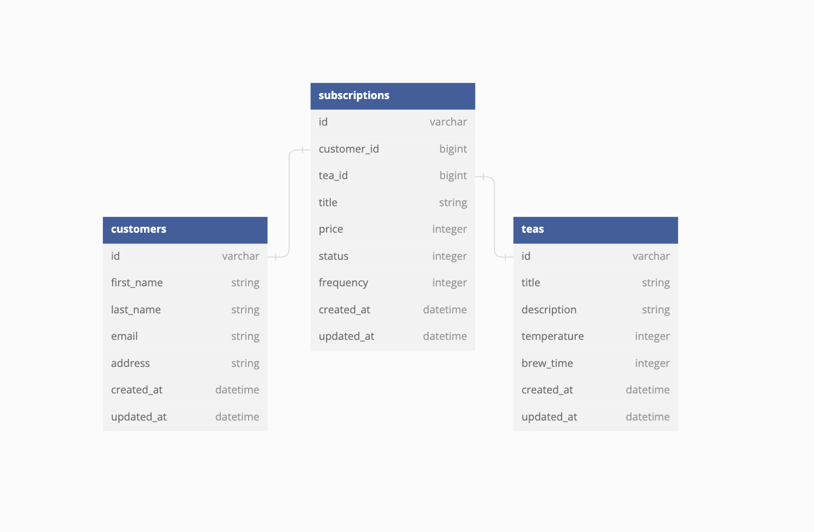

<a name="readme-top"></a>

<h1 align="center"><strong>Tea House</strong></h1>

  <p align="center">
    <h2> A Backend microservice to perform CRUD functionality for customer tea subcriptions</h2>
    <br />
    <a href="https://github.com/neb417/tea_house"><strong>Explore the docs »</strong></a>
    <br />
    <br />
    ·
    <a href="https://github.com/neb417/tea_house/issues">Report Bug</a>
    ·
    <a href="https://github.com/neb417/tea_house/issues">Request Feature</a>
  </p>
</div>
<br>

# About The Project
<details>
  <h3><summary>Table of Contents</summary></h3>
  <ol>
    <li>
      <a href="#about-the-project">About The Project</a>
        <li><a href="#built-with">Built With</a></li>
    </li>
    <li>
      <a href="#getting-started">Getting Started</a>
        <li><a href="#prerequisites">Prerequisites</a></li>
        <li><a href="#installation">Installation</a></li>
    </li>
    <li><a href="#contributing">Contributing</a></li>
    <li><a href="#apis">APIs</a></li>
    <li><a href="#contacts">Contacts</a></li>
  </ol>
</details>
 

### Built With
<div align="center">

[![Contributors][contributors-shield]][contributors-url]
[![Forks][forks-shield]][forks-url]
[![Issues][issues-shield]][issues-url]


</div>


### Getting Started
<br />

#### Prerequistites

The Tea House backend is build on Rails 5.2.8.1 and Ruby 2.7.4


#### Installation and setup
1. Clone the repo
   ```sh
   git clone git@github.com:neb417/tea_house.git
   ```

1. Add gems
   In group :development, :test do

   ```sh
    gem 'capybara'
    gem 'factory_bot_rails'
    gem 'faker'
    gem 'pry'
    gem 'rspec-rails'
    gem 'rubocop-faker'
    gem 'rubocop-rails'
    gem 'shoulda-matchers'
    gem 'simplecov'
   ```

1. Install Gems with `$bundle install`

1. Migrate database with `$rails db:{create,migrate}`

1. Seed development/test database with `$rails db:seed`

1. Run test suite with `$bundle exec rspec`

<p align="right">(<a href="#readme-top">back to top</a>)</p>

--------

 #### Database Schema


<div align="center">
  
</div>


<p align="right">(<a href="#readme-top">back to top</a>)</p>

---------

## Endpoints and Testing in Postman

* GET a customer subsctriptions by customer id
```sh
Postman:
GET http://localhost:3000/api/v1/subscriptions

query params
  key: customer_id
  value: 2
```

```sh
{
  "data": {
      "subscriptions": [
          {
              "id": 4,
              "price": 500,
              "status": "cancelled",
              "frequency": 14,
              "title": "Rize",
              "tea": {
                  "title": "Rize",
                  "description": "Meditation fanny pack kickstarter truffaut kinfolk aesthetic blue bottle chia.",
                  "temperature": 100,
                  "brew_time": 222
              }
          },
          {
              "id": 5,
              "price": 3008,
              "status": "active",
              "frequency": 14,
              "title": "Gaoshan",
              "tea": {
                  "title": "Gaoshan",
                  "description": "Echo chia selfies slow-carb keytar viral authentic jean shorts.",
                  "temperature": 93,
                  "brew_time": 233
              }
          },
          {
              "id": 10,
              "price": 500,
              "status": "active",
              "frequency": 7,
              "title": "English Breakfast",
              "tea": {
                  "title": "English Breakfast",
                  "description": "Street shabby chic hella butcher occupy five dollar toast mumblecore chia banjo.",
                  "temperature": 92,
                  "brew_time": 211
              }
          }
      ]
  }
}
```

* CREATE a customer subscription
```sh
Postman:
POST http://localhost:3000/api/v1/subscriptions

query params
  key: customer_id, value: 2
  key: tea_id, value: 1
  key: title, value: English Breakfast
  key: frequency, value: 7
  key: price, value: 500
```


```sh
{
  "data": {
      "id": 10,
      "price": 500,
      "status": "active",
      "frequency": 7,
      "title": "English Breakfast",
      "tea": {
          "title": "English Breakfast",
          "description": "Street shabby chic hella butcher occupy five dollar toast mumblecore chia banjo.",
          "temperature": 92,
          "brew_time": 211
      }
  }
}
```

* UPDATE a customer subscription
```sh
Postman:
PUT http://localhost:3000/api/v1/subscriptions/4

query params
  key: id, value: 4
  key: customer_id, value: 2
  key: tea_id, value: 1
  key: frequency, value: 7
  key: price, value: 500
  status: cancelled
```
```sh
{
    "data": {
        "success": "Your subscriptions have been updated"
    }
}
```

* CREATE a customer
```sh
Postman:
POST http://localhost:3000/api/v1/customers

query params
  key: first_name, value: Jerry
  key: last_name, value: Johnson
  key: email, value: mail@mail.com
  key: address, value: 123 South St, Town, ST, 12345
```

```sh
{
    "data": {
        "id": 6,
        "first_name": "Jerry",
        "last_name": "Johnson",
        "email": "mail@mail.com",
        "address": "123 South St, Town, ST, 12345"
    }
}
```
---------
<div align="center">

#### Gem Documentation

<table>
  <tr>
    <td align="center"><a href="https://github.com/teamcapybara/capybara">Capybara</a></td>
    <td align="center"><a href="https://github.com/thoughtbot/factory_bot_rails">factory_bot_rails</a></td>
    <td align="center"><a href="https://github.com/faker-ruby/faker">faker</a></td>
  </tr>
  <tr>
    <td align="center"><a href="https://github.com/pry/pry">pry</a></td>
    <td align="center"><a href="https://github.com/rspec/rspec-rails">rspec-rails</a></td>
    <td align="center"><a href="https://github.com/rubocop/rubocop-rails">rubocop-faker</a></td>
  </tr>
  <tr>
    <td align="center"><a href="https://github.com/koic/rubocop-faker">rubocop-rails</a></td>
    <td align="center"><a href="https://github.com/thoughtbot/shoulda-matchers">shoulda-matchers</a></td>
    <td align="center"><a href="https://github.com/simplecov-ruby/simplecov">simplecov</a></td>
  </tr>
</table>
</div>

------

<div align="center">

## Contact

***Contributor:***

<table align="center">
    <tr>
        <td align="center"> Benjamin Randolph: <a href="https://github.com/neb417">GitHub</a> || <a href="https://www.linkedin.com/in/benjamin-randolph-43881a95/">LinkedIn</a></td>
    </tr>
 <td align="center"></td>
</table>


Project Link: [Tea House](https://github.com/neb417/tea_house)


<p align="right">(<a href="#readme-top">back to top</a>)</p>
</div>

[contributors-shield]: https://img.shields.io/github/contributors/neb417/tea_house.svg?style=for-the-badge
[contributors-url]: https://github.com/neb417/tea_house/graphs/contributors
[forks-shield]: https://img.shields.io/github/forks/neb417/tea_house.svg?style=for-the-badge
[forks-url]: https://github.com/neb417/tea_house/network/members
[issues-shield]: https://img.shields.io/github/issues/neb417/tea_house.svg?style=for-the-badge
[issues-url]: https://github.com/neb417/tea_house/issues
